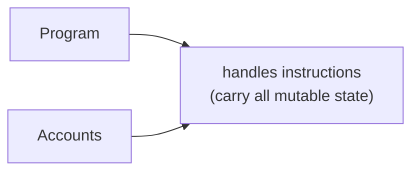

# erc4626-solana

## What is ERC4626 on Solana?

ERC‑4626 is a Tokenized Vault Standard that defines a canonical interface for vaults that accept a single underlying ERC‑20 asset and issue share tokens representing proportional ownership. It formalises the deposit/mint/withdraw/redeem lifecycle, plus view functions for safe off‑chain previews.

### Key Characteristics
- Single‑asset custody: Vault holds one ERC‑20; all math expressed in that asset.
- Share accounting: totalAssets() ↔ totalSupply(); convertToShares() & convertToAssets() guarantee predictable ratios.
- Composable interface: DEXes, aggregators, and front‑ends can integrate any compliant vault without custom adapters.
- Strategy‑agnostic: Yield farming, lending, staking, or delta‑neutral - strategy lives behind the same facade.


## Solana Program & Account Model
What exactly is a 'Program'?
Solana Programs are shared ELF‑BPF binaries deployed once and reused forever. They are pure logic - stateless, immutable, upgradeable only via a governance‑controlled “ProgramData” account.



Deployment feel: Think of Uniswap‑v2 Router being the only swap contract you’ll ever deploy; every new liquidity pool would instead be a new data account the Router controls.

### Accounts = Storage Containers
When you create an account on Solana, you first specify its exact data size (for example, space = 128 bytes). The blockchain then reserves that amount of storage, and you deposit lamports (the network’s fee currency) in proportion to the size. If the deposit meets the rent‑exempt threshold, the account never pays ongoing rent. Each account also has an owner field that stores the public key of a specific program, and only that program can modify the account’s data; any transaction from another program cannot alter it.

### PDA (Program‑Derived Address)
A Program Derived Address (PDA) is generated deterministically from a program ID and a fixed set of seeds, so it has no private key. Because it cannot sign transactions off‑chain, the Solana runtime supplies a synthetic signature when the program calls invoke_signed(), treating the PDA as if it had signed. This lets the program use the PDA like its own wallet, holding mint authority, token accounts, or configuration data, while eliminating any risk of key theft or forged permissions. In effect, the PDA itself becomes the owner, replacing Solidity’s onlyOwner pattern with Solana’s built‑in authority model.

#### CPI (Cross‑Program Invocation)
The token::transfer(...) call above makes a cross‑program invocation to the SPL Token program. It serves the same purpose as IERC20.transferFrom on Ethereum, but in Solana’s account model you must provide every account (from, to, authority) along with the PDA signer seeds that the callee will read or write. Before the instruction runs, the runtime verifies that each account has the required writable or signer permissions, so the transfer executes atomically and leaves no room for dynamic reentrancy exploits.

## Authoritative Flow in an ERC‑4626‑style Vault Deposit
**Deposit**
- Tx includes: user’s Token Account (signer), Vault Token Account (writable), Share Mint (writable), Vault State PDA (writable).
- CPI #1 → spl_token::transfer user → vault.
- CPI #2 → spl_token::mint_to shares → user.

**Withdraw / Redeem**
- Reverse order: burn shares → transfer underlying out.

**State Update inside the program (vault_state.total_assets += amount)**

Because every account touched is explicit in the Tx, wallets can simulate side effects and show accurate previews to users at signing time.

## What Does a Token Extension Program for ERC-4626 Look Like?
This contract implements a vault that follows the ERC 4626 economic model while using an external Spl20 token as its underlying asset. In the constructor it records the Spl20 contract address and that token’s mint address, then queries the token’s decimal places (assetDecimals) through the Spl20 interface. The vault’s total assets are retrieved in the totalAssets function by calling getTokenAccount on the Spl20 contract and reading the balance held by this contract address. Based on that value, convertToShares and convertToAssets keep the correct proportion between underlying assets and vault shares.

Shares are not issued through a separate token contract; they are tracked with simple shareBalance and shareAllowance mappings, and the _mint and _burn functions update the overall share supply (totalShareSupply). During a deposit the contract first checks that the incoming asset amount is greater than zero, moves those assets into the vault with spl20.transfer, calculates the proportional share amount, and credits it to the receiver. During a redemption it verifies ownership or allowance, burns the specified shares, and sends the corresponding amount of underlying assets back to the receiver through another spl20.transfer.

A custom nonReentrant modifier guards both state‑changing functions. It sets a locked flag on entry to block nested calls and clears it on exit, preventing reentrancy attacks. Overall the contract provides a minimal ERC 4626‑style vault that mints and burns internal shares as users deposit and withdraw Spl20 tokens, maintains the asset‑to‑share ratio, and includes basic approval logic and reentrancy protection while avoiding reliance on an external share token implementation.

```solidity
// SPDX-License-Identifier: MIT
pragma solidity ^0.8.24;

interface ISpl20 {
    function mintTokens(address to, address mintAddr, uint256 amount) external;
    function transfer(address to, address mintAddr, uint256 amount) external;
    function getMint(address mintAddr) external view returns (uint8, uint256, address, address, address);
    function getTokenAccount(address owner, address mintAddr) external view returns (address, address, uint256, bool);
}

contract Spl4626Vault {
    ISpl20  public immutable spl20;
    address public immutable mintAddr;
    uint8   public immutable assetDecimals;
    uint256 public totalShareSupply;

    mapping(address => uint256) public shareBalance;
    mapping(address => mapping(address => uint256)) public shareAllowance;

    bool private locked;

    event Approval(address indexed owner, address indexed spender, uint256 value);
    event Deposit(address indexed caller, address indexed owner, uint256 assets, uint256 shares);
    event Withdraw(address indexed caller, address indexed receiver, address indexed owner, uint256 assets, uint256 shares);

    modifier nonReentrant() {
        require(!locked, "REENTRANCY");
        locked = true;
        _;
        locked = false;
    }

    constructor(ISpl20 _spl20, address _mintAddr) {
        spl20 = _spl20;
        mintAddr = _mintAddr;
        (uint8 dec,, , ,) = _spl20.getMint(_mintAddr);
        assetDecimals = dec;
    }

    function totalAssets() public view returns (uint256 assets) {
        (, , assets, ) = spl20.getTokenAccount(address(this), mintAddr);
    }

    function convertToShares(uint256 assets) public view returns (uint256) {
        return totalShareSupply == 0 ? assets : (assets * totalShareSupply) / totalAssets();
    }

    function convertToAssets(uint256 shares) public view returns (uint256) {
        return totalShareSupply == 0 ? shares : (shares * totalAssets()) / totalShareSupply;
    }

    function _mint(address to, uint256 amount) internal {
        totalShareSupply += amount;
        shareBalance[to] += amount;
    }

    function _burn(address from, uint256 amount) internal {
        shareBalance[from] -= amount;
        totalShareSupply -= amount;
    }

    function approve(address spender, uint256 amount) external returns (bool) {
        shareAllowance[msg.sender][spender] = amount;
        emit Approval(msg.sender, spender, amount);
        return true;
    }

    function deposit(uint256 assets, address receiver) external nonReentrant returns (uint256 shares) {
        require(assets > 0, "zero assets");
        spl20.transfer(address(this), mintAddr, assets);
        shares = convertToShares(assets);
        _mint(receiver, shares);
        emit Deposit(msg.sender, receiver, assets, shares);
    }

    function redeem(uint256 shares, address receiver, address owner) external nonReentrant returns (uint256 assets) {
        require(shares > 0, "zero shares");
        if (msg.sender != owner) {
            uint256 allowed = shareAllowance[owner][msg.sender];
            require(allowed >= shares, "allowance too low");
            if (allowed != type(uint256).max) {
                shareAllowance[owner][msg.sender] = allowed - shares;
            }
        }
        assets = convertToAssets(shares);
        _burn(owner, shares);
        spl20.transfer(receiver, mintAddr, assets);
        emit Withdraw(msg.sender, receiver, owner, assets, shares);
    }
}
```

## How to do ERC4626 on Solana

### 1. conceptual map
| Piece                      | On‑chain Object                      | Purpose                                                                   |
|----------------------------|--------------------------------------|---------------------------------------------------------------------------|
| Underlying Mint            | Mint (already exists)                | The ERC‑20‑equivalent asset (e.g., **USDC**)                              |
| Share Mint                 | New Mint (PDA authority)             | Tracks proportional ownership of the vault                                |
| Vault ATA                  | Token Account (owned by PDA)         | Holds the underlying assets                                               |
| Vault State PDA            | Small data account                   | Stores `share_mint`, `pda_bump`, optional fees                            |
| Token Account Owner PDA    | Signer PDA                           | Authority over Vault ATA and Share Mint                                   |

one tx always moves exactly one underlying asset and, if necessary, mints/burns the exact proportional number of shares. everything else is bookkeeping.

### 2. end‑to‑end call flow (simplified)
1) deposit (assets → shares)

2) tx composer (wallet)
- adds: user ata, vault ata, share mint, vault state, pda, token program
- invokes program deposit(assets)

3) Program
- token::transfer (user → vault)
- compute shares = assets * total_supply / total_assets
- token::mint_to (shares → user) using token_account_owner_pda as signer
- update vault_state.total_assets (optional, can always recompute)
- emit DepositEvt

4) wallet preview: because every account is explicit, it can show -X assets & +Y shares before signing.

5) redeem / withdraw (shares → assets) is the same sequence in reverse order.

### 3. Write program
Imagine launching a tiny Solana vault that behaves like an ERC‑4626 clone. At initialization a single transaction seeds three key PDAs: a VaultState account that records the share‑mint address and bump, a program‑owned share mint, and a token‑vault account that will hold the underlying asset. The same PDA signer, token_account_owner_pda, is cached inside VaultState, letting the program act as custodian without ever exposing a private key. When a user calls deposit, the vault pulls their tokens in, mints proportional “shares,” and emits a DepositEvt, giving indexers an audit trail. The first depositor enjoys a 1 : 1 exchange rate, while later deposits use the classic supply × assets / totalAssets formula to keep shares aligned with vault value. Conversely, redeem burns the user’s shares, computes their slice of the pot, and ships the underlying tokens back out, firing a WithdrawEvt for good measure. Both CPI flows rely purely on token::transfer, mint_to, and burn, so Anchor’s safety checks guard every balance change. No yield strategy or fee logic is baked in; this snippet is the minimalist chassis you’d plug a strategy into. About ninety lines of Rust, yet it delivers the full “deposit, mint, withdraw, redeem” life‑cycle familiar to anyone who has integrated an ERC‑4626 vault on Ethereum.

```rust
use anchor_lang::prelude::*;
use anchor_spl::token::{
    self, Mint, Token, TokenAccount,
    Transfer, MintTo, Burn,
};

declare_id!("VaUlt4626pHkYwWjSfERn6y6oAYcg4UH8zQcAXXXXXXXXX"); // replace after deploy

#[account]
pub struct VaultState {
    pub share_mint: Pubkey,
    pub pda_bump:   u8,
}
const VAULT_STATE_SIZE: usize = 8 + 32 + 1;

#[program]
pub mod spl_4626_vault {
    use super::*;

    pub fn initialize(ctx: Context<Initialize>) -> Result<()> {
        let state        = &mut ctx.accounts.vault_state;
        state.share_mint = ctx.accounts.share_mint.key();
        state.pda_bump   = *ctx.bumps.get("token_account_owner_pda").unwrap();
        Ok(())
    }

    pub fn deposit(ctx: Context<Deposit>, assets: u64) -> Result<()> {
        require!(assets > 0, CustomError::ZeroAmount);
        token::transfer(ctx.accounts.transfer_into_vault_ctx(), assets)?;

        let supply        = ctx.accounts.share_mint.supply;
        let total_assets  = ctx.accounts.vault_token_account.amount;
        let shares = if supply == 0 {
            assets
        } else {
            (assets as u128 * supply as u128 / total_assets as u128) as u64
        };

        token::mint_to(ctx.accounts.mint_shares_ctx(), shares)?;

        emit!(DepositEvt {
            caller:   ctx.accounts.signer.key(),
            receiver: ctx.accounts.signer.key(),
            assets,
            shares,
        });
        Ok(())
    }

    pub fn redeem(ctx: Context<Redeem>, shares: u64) -> Result<()> {
        require!(shares > 0, CustomError::ZeroAmount);

        let supply        = ctx.accounts.share_mint.supply;
        let total_assets  = ctx.accounts.vault_token_account.amount;
        let assets        = (shares as u128 * total_assets as u128 / supply as u128) as u64;

        token::burn(ctx.accounts.burn_shares_ctx(), shares)?;
        token::transfer(ctx.accounts.transfer_out_ctx(), assets)?;

        emit!(WithdrawEvt {
            caller:   ctx.accounts.signer.key(),
            receiver: ctx.accounts.signer.key(),
            owner:    ctx.accounts.signer.key(),
            assets,
            shares,
        });
        Ok(())
    }
}

#[event]
pub struct DepositEvt {
    pub caller:   Pubkey,
    pub receiver: Pubkey,
    pub assets:   u64,
    pub shares:   u64,
}

#[event]
pub struct WithdrawEvt {
    pub caller:   Pubkey,
    pub receiver: Pubkey,
    pub owner:    Pubkey,
    pub assets:   u64,
    pub shares:   u64,
}

#[error_code]
pub enum CustomError {
    #[msg("amount must be > 0")]
    ZeroAmount,
}

#[derive(Accounts)]
pub struct Initialize<'info> {
    #[account(
        init,
        payer  = signer,
        seeds  = [b"vault_state"],
        bump,
        space  = VAULT_STATE_SIZE,
    )]
    pub vault_state: Account<'info, VaultState>,

    #[account(seeds = [b"token_account_owner_pda"], bump)]
    /// CHECK: program‑derived signer
    pub token_account_owner_pda: AccountInfo<'info>,

    #[account(
        init,
        payer = signer,
        seeds = [b"share_mint"],
        bump,
        mint::decimals   = mint_of_token_being_sent.decimals,
        mint::authority  = token_account_owner_pda,
    )]
    pub share_mint: Account<'info, Mint>,

    #[account(
        init,
        payer = signer,
        seeds = [b"token_vault", mint_of_token_being_sent.key().as_ref()],
        bump,
        token::mint      = mint_of_token_being_sent,
        token::authority = token_account_owner_pda,
    )]
    pub vault_token_account: Account<'info, TokenAccount>,

    pub mint_of_token_being_sent: Account<'info, Mint>,

    #[account(mut)] pub signer: Signer<'info>,
    pub system_program: Program<'info, System>,
    pub token_program:  Program<'info, Token>,
    pub rent:           Sysvar<'info, Rent>,
}

#[derive(Accounts)]
pub struct Deposit<'info> {
    #[account(mut, seeds=[b"vault_state"], bump)]
    pub vault_state: Account<'info, VaultState>,
    #[account(seeds=[b"token_account_owner_pda"], bump)]
    /// CHECK:
    pub token_account_owner_pda: AccountInfo<'info>,

    #[account(mut,
        seeds=[b"token_vault", mint_of_token_being_sent.key().as_ref()],
        bump,
        token::mint      = mint_of_token_being_sent,
        token::authority = token_account_owner_pda
    )]
    pub vault_token_account: Account<'info, TokenAccount>,

    #[account(mut)] pub sender_token_account: Account<'info, TokenAccount>,
    #[account(mut)] pub sender_share_account: Account<'info, TokenAccount>,

    #[account(seeds=[b"share_mint"], bump)]
    pub share_mint: Account<'info, Mint>,
    pub mint_of_token_being_sent: Account<'info, Mint>,

    #[account(mut)] pub signer: Signer<'info>,
    pub token_program: Program<'info, Token>,
}

#[derive(Accounts)]
pub struct Redeem<'info> {
    #[account(mut, seeds=[b"vault_state"], bump)]
    pub vault_state: Account<'info, VaultState>,
    #[account(seeds=[b"token_account_owner_pda"], bump)]
    /// CHECK:
    pub token_account_owner_pda: AccountInfo<'info>,

    #[account(mut,
        seeds=[b"token_vault", mint_of_token_being_sent.key().as_ref()],
        bump,
        token::mint      = mint_of_token_being_sent,
        token::authority = token_account_owner_pda
    )]
    pub vault_token_account: Account<'info, TokenAccount>,

    #[account(mut)] pub sender_token_account: Account<'info, TokenAccount>,
    #[account(mut)] pub sender_share_account: Account<'info, TokenAccount>,

    #[account(seeds=[b"share_mint"], bump)]
    pub share_mint: Account<'info, Mint>,
    pub mint_of_token_being_sent: Account<'info, Mint>,

    #[account(mut)] pub signer: Signer<'info>,
    pub token_program: Program<'info, Token>,
}

impl<'info> Deposit<'info> {
    fn transfer_into_vault_ctx(&self) -> CpiContext<'_, '_, '_, 'info, Transfer<'info>> {
        CpiContext::new(
            self.token_program.to_account_info(),
            Transfer {
                from:      self.sender_token_account.to_account_info(),
                to:        self.vault_token_account.to_account_info(),
                authority: self.signer.to_account_info(),
            },
        )
    }

    fn mint_shares_ctx(&self) -> CpiContext<'_, '_, '_, 'info, MintTo<'info>> {
        let seeds = &[b"token_account_owner_pda", &[self.vault_state.pda_bump]];
        CpiContext::new_with_signer(
            self.token_program.to_account_info(),
            MintTo {
                mint:      self.share_mint.to_account_info(),
                to:        self.sender_share_account.to_account_info(),
                authority: self.token_account_owner_pda.to_account_info(),
            },
            &[seeds],
        )
    }
}

impl<'info> Redeem<'info> {
    fn burn_shares_ctx(&self) -> CpiContext<'_, '_, '_, 'info, Burn<'info>> {
        let seeds = &[b"token_account_owner_pda", &[self.vault_state.pda_bump]];
        CpiContext::new_with_signer(
            self.token_program.to_account_info(),
            Burn {
                mint:      self.share_mint.to_account_info(),
                from:      self.sender_share_account.to_account_info(),
                authority: self.token_account_owner_pda.to_account_info(),
            },
            &[seeds],
        )
    }

    fn transfer_out_ctx(&self) -> CpiContext<'_, '_, '_, 'info, Transfer<'info>> {
        let seeds = &[b"token_account_owner_pda", &[self.vault_state.pda_bump]];
        CpiContext::new_with_signer(
            self.token_program.to_account_info(),
            Transfer {
                from:      self.vault_token_account.to_account_info(),
                to:        self.sender_token_account.to_account_info(),
                authority: self.token_account_owner_pda.to_account_info(),
            },
            &[seeds],
        )
    }
}
```

